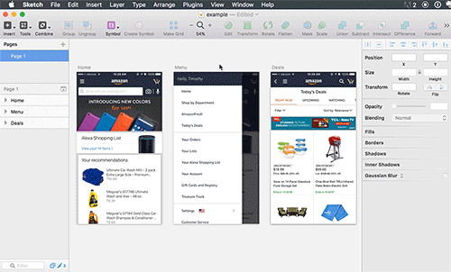

# Sketch-Quick-Presentation

A Sketch plugin to quickly share multiple artboards with an optional title.

## Download and installation

1. [Download the plugin ZIP](https://github.com/timothywhalin/Sketch-Quick-Presentation/archive/master.zip).
2. Unzip the downloaded file and double click "Quick Presentation.sketchplugin". It will be automatically installed into Sketch.

## Create an artboard around selected artboards

Plugins / Quick Presentation / Without Titles

## Create an artboard around selected artboards and add a title above each

Plugins / Quick Presentation / With Titles

## Customize the plugin

To edit: Right-click 'Quick Presentation.sketchplugin' → Select 'Show Package Contents' → Open config.js in a text editor.

- **docSize**: Defaults to 1 for designing at 1x. Change it to '2' if you're designing at 2x.
- **margin**: Sets the margin around your presentation. Default: 20
- **artboardColor**: Sets the artboard background color. Default: #E6E6E6
- **artboardTitle**: Sets the title for the new artboard presentation that will be created. Default: example
- **titleAboveScreens**: Sets the default text for screen titles. If this is commented out, then it will use the artboard title as the text. Default: ScreenTitle
- **fontType**: Font type for titles above artboards. Default: Helvetica
- **fontColor**: Font color for titles above artboards. Default: #2F5060
- **fontSize**: Base font size for titles. This will double when docSize set to 2. Default: 18

## Feature requests and feedback
Ping me on [twitter](http://twitter.com/timothywhalin) or follow for updates.

## Special thanks
to [Jason Burns](https://github.com/sonburn/) for help on getting the artboard to the back.
